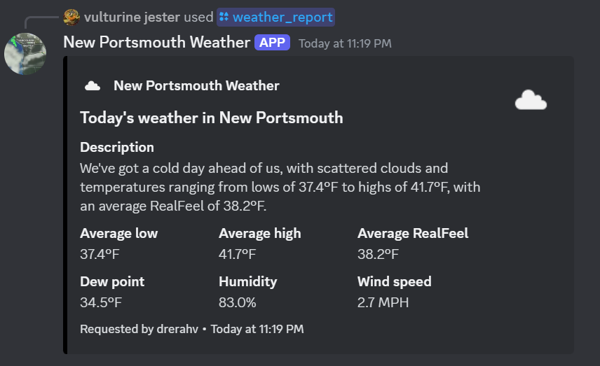

# New Portsmouth Weather Bot

Tune in to the KRKN to hear the latest in weather...

The New Portsmouth Weather Bot provides on-demand weather reports to players. Weather reports change each day, providing an illusion of a constantly changing climate (and providing some nice references for our players who are new to the pacific northwest!)

This weather bot has an internal date that it uses to fetch either historical or customized weather data, depending on whether the current date falls inside the range of a custom event (see Event commands section). This internal date is intentionally obsfucated from regular players, but can be accessed and changed by mods using the date management commands.

The bot is set to auto-advance its internal date at 00:00 PST every day, meaning that users should be able to experience weather that changes by the day without mods needing to change the date themselves.

Weather reports themselves are designed to be 'informative' by providing climate information while remaining intentionally vague about exact dates and times, to avoid conflicting with Anima Mundi's non-real time setting.

Custom weather events can be created and even edited for very granular customization of a given day's climate, right down to wind speed. It should be noted that the bot will not end events on rollover - if it detects it's about to roll out of an event, it will instead roll its date back to the start of the event to prevent the weather event from ending before the mods are ready.

## Commands for the average guy

- **/weather_report time_period:<today|day|week|month>**
  Gives you a cute print-out of a given timeframe's weather. Note that it averages weather data across your given timeframe - ergo, you might get slightly different answers depending on whether you ask for the day, week, or month.

## Commands for the mods

Oh, man.

### Date management commands

- **/get_date**
  Gets the bot's current date.

- **/set_date date:<YYYY/MM/DD | July 7 2024 | etc>**
  Sets the bot's current date to the one you specified. Note that the bot's historical weather data falls between December 31, 2022 and December 7, 2024, and any dates outside of this range will not have associated weather data.

- **/rollover_date**
  Manually advances the bot's internal date by one day. Useful if you're trying to advance into an Event.
  Note that the bot will automatically roll back to December 31, 2022 if it detects it's attempting to roll out of its valid range (December 31, 2022 - December 7, 2024).
  Do note that the bot will automatically advance its date as soon as it has been online for longer than one day.

### Event commands

Event commands are largely how mods will be able to customize the weather experience for the roleplay setting. I've tried to make it so event creation is as detailed as possible to allow for a high level of customizability.

- **/create_event start_date:<YYYY:MM:DD|July 7 2023|etc> time_period:<day|week|month> chance_rain:<0-100> chance_snow:<0-100> min_temp:<#, fahrenheit> max_temp:<#, fahrenheit> min_precipitation:<#, inches> max_precipitation:<#, inches> min_cloud_cover:<0-100> max_cloud_cover:<0-100> min_humidity:<0-100> max-humidity:<0-100> min_windspeed:<0-100> max_windspeed:<0-100>**

Do note that all 'min' values MUST be less than or equal to their 'max' values or the bot will be unhappy.

Every argument (except for start_date and time_period) is OPTIONAL! If you don't fill an argument, the bot will take the missing argument(s), your start date, and the time period, and fetch the historical minimums and maximums from that time period.

So, for example, if you don't have a min_windspeed argument, the bot will search through the data for the LOWEST windspeed recorded in that <time_period>, and insert that as your minimum windspeed parameter when calculating wind-speed for each day during the event. This helps ensure that the illusion of seasons and natural weather stays put and the user doesn't need to do a ton of climate research in order to create a 'believable' weather event. If the data says the area is naturally windy in the spring, and you haven't specified for your springtime event to not be windy, your event will also be windy.

After generating every value expected for your given timeframe, it will then re-populate a copy of the json that's stored on the back-end and re-insert this copy into the back end with a key of 'EVENT_YYYY-MM'.

Note that dew point cannot be specified as a parameter currently. I could add dew point customization if requested, but as of now the dew point is calculated based on the humidity and temperature of a given date as that felt the most realistic (and was based on the formula (https://learnmetrics.com/dew-point-calculator-chart-formula/)[here].) 

- **/list_events**
  Lists all the current events stored in the bot's memory, their redis keys, and the Unix times at which they start and stop.

- **/download_event redis_key:<KEY_NAME>**
  This command prompts the bot to offer the raw data of the specified key as a .json attachment. You can use this to inspect an event to verify that it's been generated correctly, OR you could use this in conjunction with **/overwrite_event redis_key:<KEY_NAME>** to further customize a given event.

- **/overwrite_event redis_key:<KEY_NAME>**
  Allows you to upload .json as an attachment to replace an event's data. WARNING: If you upload invalid json the weather data for your event will break!

### Uptime commands

- **/uptime**
  Gives the bot's current uptime.

### Weather report commands

- **/debug_list_reports**
  Prompts the bot to send you a text file of EVERY SINGLE POSSIBLE WEATHER REPORT. I used it to proofread reports.
